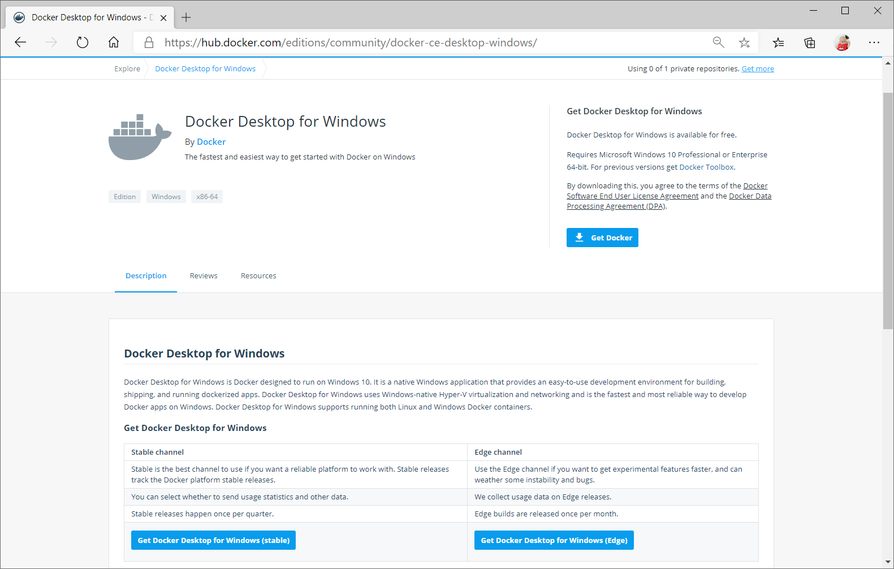
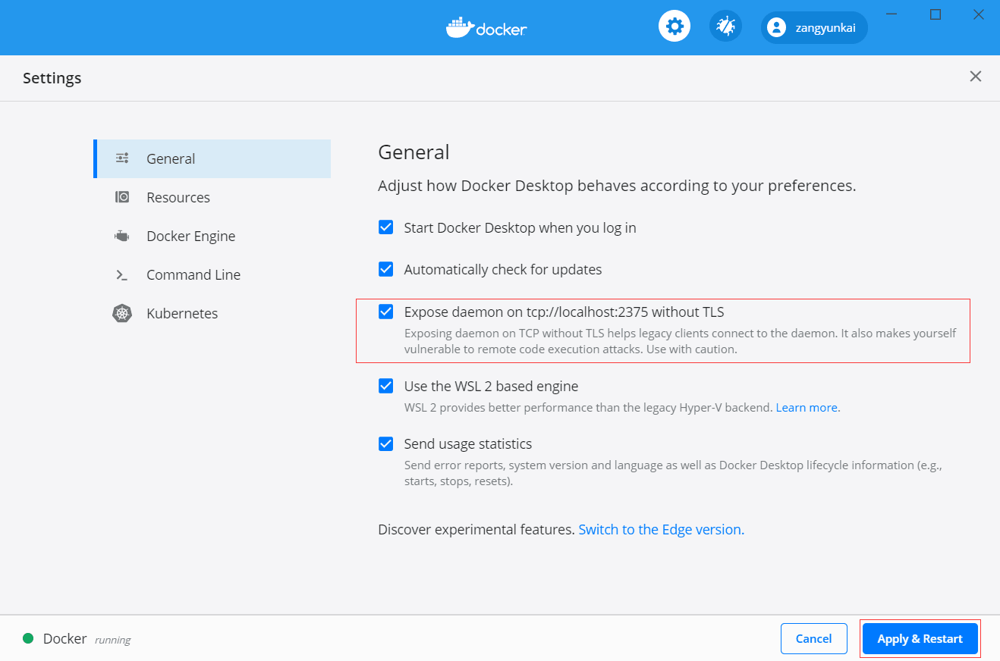
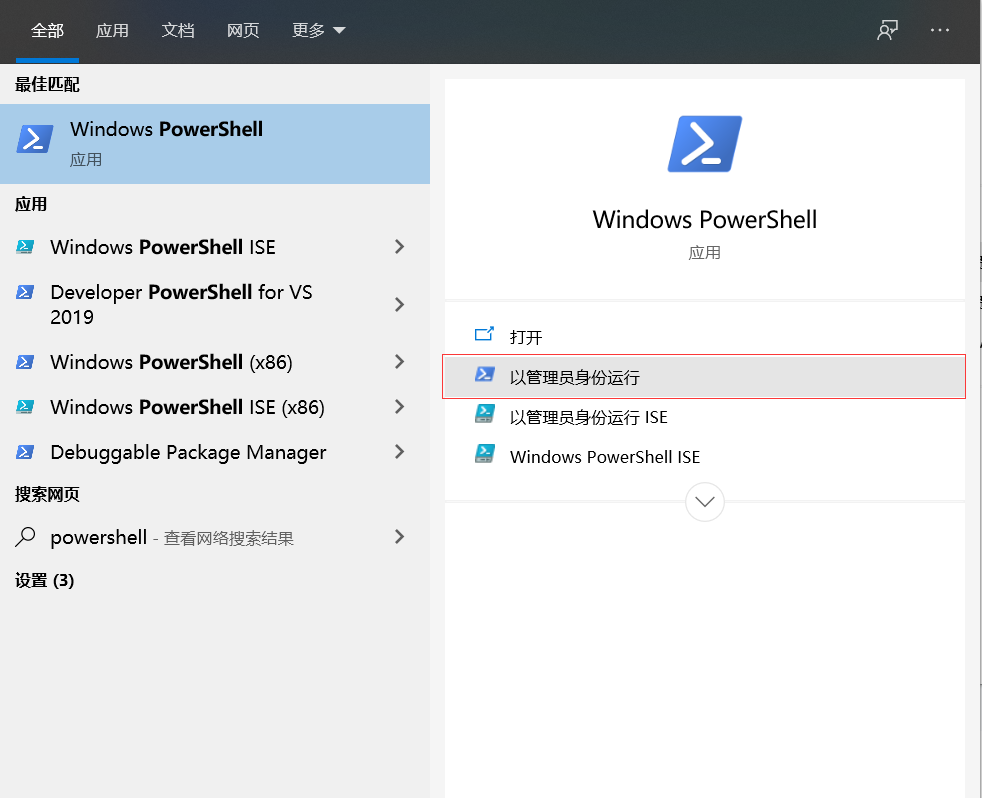
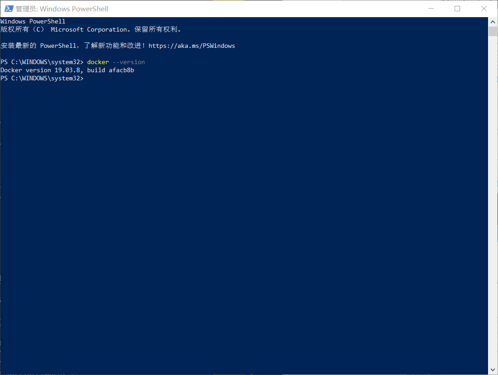
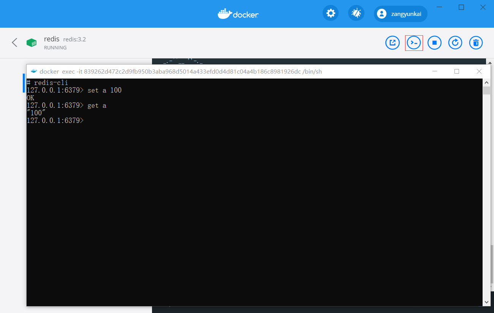
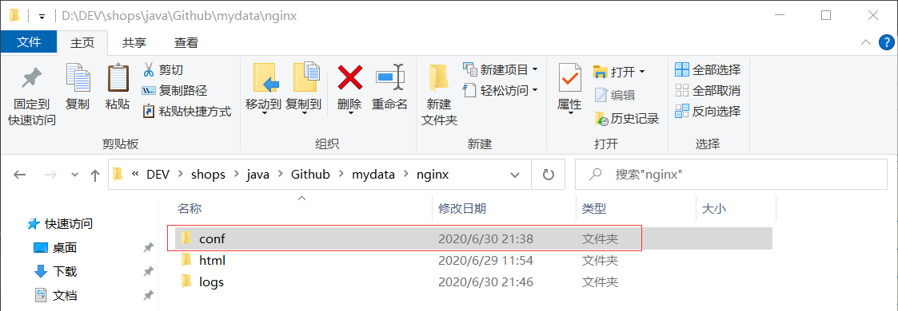
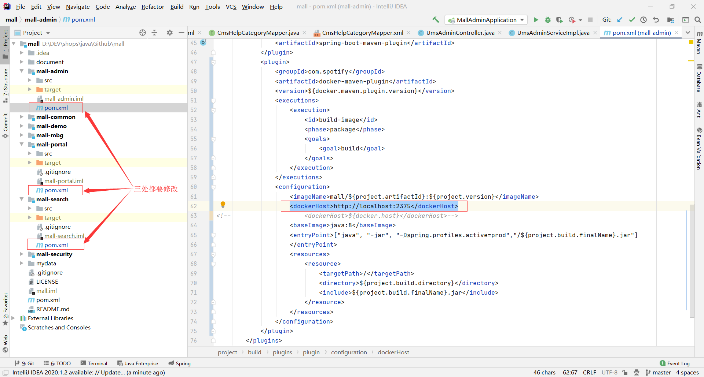

mall项目全套学习教程连载中，[关注公众号](#公众号)第一时间获取。

# mall在Windows环境下的部署(基于Docker Desktop for Windows )

> 本文主要以图文的形式讲解mall项目所需环境在windows中如何在Docker容器下部署的安装，涉及到大量系统组件的部署及多个Spring Cloud 微服务应用的部署。

## Docker 环境安装
- 下载并安装Docker Desktop for Windows，下载地址：[https://download.docker.com/win/stable/Docker%20Desktop%20Installer.exe](https://download.docker.com/win/stable/Docker%20Desktop%20Installer.exe)
<br>也可以访问手动下载:<br>
[https://hub.docker.com/editions/community/docker-ce-desktop-windows/](https://hub.docker.com/editions/community/docker-ce-desktop-windows/)
<br>


- 设置Docker Desktop for Windows
<br>1. 启用2375端口

<br>2. 修改Docker配置文件


## 运行Windows PowerShell（以管理员身份运行）

- 检查Docker版本是否正确
```shell
 docker --version
```


## 创建mydata文件夹


## Mysql安装
- 下载mysql5.7的docker镜像：
```shell
docker pull mysql:5.7
```
- 使用docker命令启动：
```shell
  docker run -p 3306:3306 --name mysql -v D:/DEV/shops/java/Github/mydata/mysql/log:/var/log/mysql -v D:/DEV/shops/java/Github/mydata/mysql/data:/var/lib/mysql -v D:/DEV/shops/java/Github/mydata/mysql/conf:/etc/mysql -e MYSQL_ROOT_PASSWORD=root  -d mysql:5.7
```
- 参数说明
  - -p 3306:3306：将容器的3306端口映射到主机的3306端口
  - -v D:/DEV/shops/java/Github/mydata/mysql/conf:/etc/mysql：将配置文件夹挂在到主机
  - -v D:/DEV/shops/java/Github/mydata/mysql/log:/var/log/mysql：将日志文件夹挂载到主机
  - -v D:/DEV/shops/java/Github/mydata/mysql/data:/var/lib/mysql/：将数据文件夹挂载到主机
  - -e MYSQL_ROOT_PASSWORD=root：初始化root用户的密码

- 将mall.sql文件拷贝到mydata文件夹下：

- 将mall.sql文件拷贝到mysql容器的/目录下：
```shell
docker cp D:/DEV/shops/java/Github/mydata/mall.sql mysql:/
```
- 进入运行mysql的docker容器：
```shell
docker exec -it mysql /bin/bash
```
- 使用mysql命令打开客户端：
```shell
mysql -uroot -proot --default-character-set=utf8
```
- 创建mall数据库：
```sql
create database mall character set utf8
```
- 将sql文件导入到数据库：
```shell
use mall;
source /mall.sql;
```
- 创建一个reader帐号并修改权限，使得任何ip都能访问：
```sql
grant all privileges on *.* to 'reader' @'%' identified by '123456';
```

## Redis安装
- 下载redis3.2的docker镜像：
```shell
docker pull redis:3.2
```
- 使用docker命令启动：
```shell
  docker run -p 6379:6379 --name redis -v D:/DEV/shops/java/Github/mydata/redis/data:/data -d redis:3.2 redis-server --appendonly yes
```
- 进入redis容器使用redis-cli命令进行连接：
```shell
docker exec -it redis redis-cli
```


## Nginx安装

### 下载nginx1.10的docker镜像：
```shell
docker pull nginx:1.10
```

### 从容器中拷贝nginx配置
- 先运行一次容器（为了拷贝配置文件）：
```shell
  docker run -p 80:80 --name nginx -v D:/DEV/shops/java/Github/mydata/nginx/html:/usr/share/nginx/html -v D:/DEV/shops/java/Github/mydata/nginx/logs:/var/log/nginx  -d nginx:1.10
```
- 将容器内的配置文件拷贝到指定目录：
```shell
docker container cp nginx:/etc/nginx D:/DEV/shops/java/Github/mydata/nginx/
```
- 修改文件名称为conf：

- 终止并删除容器：
```shell
docker stop nginx
docker rm nginx
```

### 使用docker命令启动：
```shell
docker run -p 80:80 --name nginx -v D:/DEV/shops/java/Github/mydata/nginx/html:/usr/share/nginx/html -v D:/DEV/shops/java/Github/mydata/nginx/logs:/var/log/nginx  -v D:/DEV/shops/java/Github/mydata/nginx/conf:/etc/nginx -d nginx:1.10
```

## RabbitMQ安装
- 下载rabbitmq3.7.15的docker镜像：
```shell
docker pull rabbitmq:3.7.15
```
- 使用docker命令启动：
```shell
  docker run -d --name rabbitmq --publish 5671:5671 --publish 5672:5672 --publish 4369:4369 --publish 25672:25672 --publish 15671:15671 --publish 15672:15672 rabbitmq:3.7.15
```
- 进入容器并开启管理功能：
```shell
docker exec -it rabbitmq /bin/bash
rabbitmq-plugins enable rabbitmq_management
```



- 访问地址查看是否安装成功：[http://localhost:15672/](http://localhost:15672/)

- 输入账号密码并登录：guest guest
- 创建帐号并设置其角色为管理员：mall mall

- 创建一个新的虚拟host为：/mall

- 点击mall用户进入用户配置页面

- 给mall用户配置该虚拟host的权限


## Elasticsearch安装
- 下载elasticsearch6.4.0的docker镜像：
```shell
docker pull elasticsearch:6.4.0
```

- 使用docker命令启动：
```shell
  docker run -p 9200:9200 -p 9300:9300 --name elasticsearch -e "discovery.type=single-node" -e "cluster.name=elasticsearch" -v D:/DEV/shops/java/Github/mydata/elasticsearch/plugins:/usr/share/elasticsearch/plugins -v D:/DEV/shops/java/Github/mydata/elasticsearch/data:/usr/share/elasticsearch/data -d elasticsearch:6.4.0
```
- 安装中文分词器IKAnalyzer，并重新启动：
```shell
docker exec -it elasticsearch /bin/bash
#此命令需要在容器中运行
elasticsearch-plugin install https://github.com/medcl/elasticsearch-analysis-ik/releases/download/v6.4.0/elasticsearch-analysis-ik-6.4.0.zip
docker restart elasticsearch
```

- 访问会返回版本信息：[http://localhost:9200/](http://localhost:9200/)


## kibana安装
- 下载kibana6.4.0的docker镜像：
```shell
docker pull kibana:6.4.0
```
- 使用docker命令启动：
```shell
  docker run --name kibana -p 5601:5601 --link elasticsearch:es -e "elasticsearch.hosts=http://es:9200" -d kibana:6.4.0
```

- 访问地址进行测试：[http://localhost:5601](http://localhost:5601)


## Mongodb安装
- 下载mongo3.2的docker镜像：
```shell
docker pull mongo:3.2
```
- 使用docker命令启动：
```shell
docker run -p 27017:27017 --name mongo -v D:/DEV/shops/java/Github/mydata/mongo/db:/data/db -d mongo:3.2
```

## Docker全部环境安装完成
- 所有下载镜像文件：

- 所有运行在容器里面的应用：


## SpringBoot应用部署

### 构建所有Docker镜像并上传
- 打开pom.xml中使用docker插件的注释：

- 修改dockerHost为你自己的docker服务器地址：
- 构建镜像并上传：  


### 部署mall-admin
```shell
docker run -p 8080:8080 --name mall-admin --link mysql:db --link redis:redis -v D:/DEV/shops/java/Github/mydata/app/admin/logs:/var/logs -d mall/mall-admin:1.0-SNAPSHOT
```
### 部署mall-search
```shell
docker run -p 8081:8081 --name mall-search --link elasticsearch:es --link mysql:db -v D:/DEV/shops/java/Github/mydata/app/search/logs:/var/logs -d mall/mall-search:1.0-SNAPSHOT
```
### 部署mall-portal
```shell
docker run -p 8085:8085 --name mall-portal --link mysql:db --link redis:redis --link mongo:mongo --link rabbitmq:rabbit -v D:/DEV/shops/java/Github/mydata/app/portal/logs:/var/logs -d mall/mall-portal:1.0-SNAPSHOT
```

### 访问接口进行测试

- mall-admin的api接口文档地址：http://localhost:8080/swagger-ui.html

- mall-search的api接口文档地址：http://localhost:8081/swagger-ui.html

- mall-portal的api接口文档地址：http://localhost:8085/swagger-ui.html


## 公众号

